# Pause — behaviour flow

How the app moves between its states: first-run setup, the floating bubble, the timer,
the wind-down, and the app-blocking break. (Renders as a diagram on GitHub.)

```mermaid
flowchart TD
    Launch([App launched]) --> Onboarded{Onboarding complete?}

    Onboarded -- No --> Wizard[Setup wizard:<br/>1. Intro &#40;logo + Pause&#41;<br/>2. Language<br/>3. Main permissions<br/>4. Usage access + apps to block<br/>5. Main app &#40;sets bubble size&#41;<br/>6. All set]
    Wizard -->|Get started| Finish[Apply chosen language,<br/>mark onboarding complete,<br/>start overlay if it can draw]
    Onboarded -- Yes --> Settings[Settings screen]

    Finish --> Idle
    Settings -->|Show the bubble| Idle
    Settings -->|Hide the bubble| Off

    Idle([Bubble floating - idle]) -->|Tap bubble| Picker[Timer picker]
    Picker -->|Set duration / clock alarm| Running
    Picker -->|Tap outside / Back| Idle
    Idle -->|Drag to dismiss target| Off

    Running([Timer running - bubble shows countdown or draining hourglass])
    Running -->|Slide to dismiss while running| CancelStop[Cancel the alarm, THEN stop the overlay]
    Running -->|Cancel timer in picker| Idle
    Running -->|Timer fires| WindDown
    CancelStop --> Off

    WindDown{Wind-down opens}
    WindDown -->|breathing on| Breathe[4-7-8 breathing - non-skippable lock window]
    WindDown -->|breathing off| Actions
    Breathe -->|lock window elapses| Actions[Keep scrolling / Stop for now / Snooze]

    Actions -->|Keep scrolling| Idle
    Actions -->|Snooze N min| Running
    Actions -->|Stop for now| StopForNow{Apps to block chosen<br/>and Usage access granted?}
    StopForNow -- Yes --> Break[App-blocking break:<br/>cover those apps when opened,<br/>bubble returns to idle]
    StopForNow -- No --> Off
    Break -->|break ends, or End break| Idle

    Off([Overlay stopped - pinned 'Start Pause' notification]) -->|Tap Start| Idle
    Off -->|Device reboot| Off
```

## Notes on specific behaviours

- **Slide to dismiss while a timer is running** drags the bubble onto the dismiss target. This
  calls `stopSelf()`, and `onDestroy()` runs `cancelPendingAlarm()` first — so the pending alarm
  is cancelled *before* the overlay is torn down, and it can never fire after the bubble is gone.
- **Keep scrolling** dismisses the wind-down only; the bubble stays floating (idle), ready for the
  next timer.
- **Stop for now** starts the app-blocking break **if** you've chosen apps to block and granted
  Usage access (the bubble returns to idle while the break covers those apps). If no apps are
  chosen, it leaves the current app and stops the overlay entirely.
- **Snooze** dismisses the wind-down and re-arms the timer for the chosen number of minutes.
- **Pinned notification.** Both notifications are ongoing and carry `FLAG_NO_CLEAR`, so “Clear all” leaves them alone: the running
  foreground-service notification, and the persistent "Start Pause" notification shown while the
  overlay is off (it is also re-posted after a reboot by `BootReceiver`). On Android 14+ the system
  still allows the user to swipe an ongoing notification away while the app is backgrounded — that
  is OS policy and can't be overridden.
- **First-run wizard** shows only on first launch (gated by `SettingsStore.onboardingComplete`).
  The chosen language is applied at *Get started* (not mid-wizard) to avoid an activity recreate
  in the middle of the flow.
